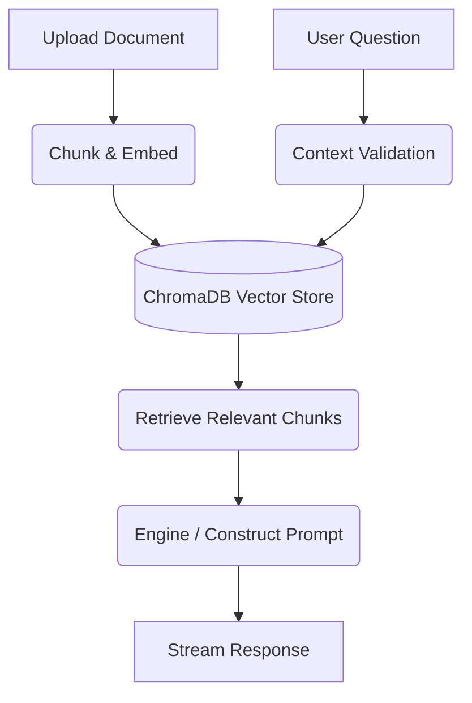

# Document Chat

[](https://nextjs.org/)
[](https://react.dev/)

A web interface for querying local documents via chat.

## Workflow Architecture



## Directory Structure

```text
/
├── app/               # Next.js App Router
├── components/        # Chat Interface & UI Components
├── lib/               # Document Processing & RAG Engine
├── public/            # Static Assets
├── chroma_data/       # Local ChromaDB Storage
└── start-app.ps1      # Quickstart Script
```

## Features

### 1. Data Formatting
Uses a tabular data schema to reduce JSON payload overhead.

### 2. Caching
Caches queries and document hashes to minimize redundant API requests.

### 3. Stateless Architecture
API keys and session data remain in browser memory and are not persisted to a database.

### 4. Context Filtering
Filters retrieved document chunks against a similarity threshold before passing them to the prompt.

## Tech Stack
* **Framework:** Next.js 15 (App Router)
* **UI/Styling:** React 19, Tailwind CSS
* **Vector Database:** ChromaDB (Local)

## Getting Started

```bash
pip install chromadb
chroma run --path ./chroma_data
```
Then run the app:
```powershell
./start-app.ps1
```

## License

MIT License © 2026 GaneshArwan